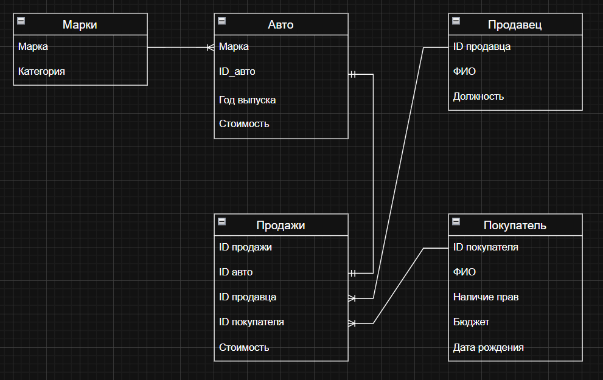

# Анализ данных автосалона на SQLite

Небольшой учебный pet-проект по работе с реляционной базой данных автосалона. В проекте есть SQLite-база, ER-диаграмма, SQL-запросы и Python-скрипт для запуска аналитических запросов из консоли.

Проект не претендует на промышленную систему продаж — это учебная работа, где основной фокус на структуре БД, связях между таблицами и простом анализе данных.

## Что есть в проекте

- `car_dealership.db` — SQLite-база данных автосалона.
- `main.py` — Python-скрипт для запуска аналитических запросов.
- `sql/schema.sql` — структура таблиц базы данных.
- `sql/analysis_queries.sql` — SQL-запросы для анализа.
- `docs/erd.png` — ER-диаграмма базы данных.
- `docs/normal_forms.md` — краткое описание нормализации до 1НФ, 2НФ и 3НФ.
- `docs/data_dictionary.md` — словарь таблиц и полей.

## Структура базы данных

В базе используются 5 основных таблиц:

| Таблица | Что хранит |
|---|---|
| `Марки` | марки автомобилей и их категории |
| `Авто` | автомобили, год выпуска и стоимость |
| `Продавец` | сотрудники автосалона |
| `Покупатель` | покупатели, бюджет и наличие прав |
| `Продажи` | факты продаж автомобилей |

Основная таблица фактов — `Продажи`. Через внешние ключи она связывается с автомобилем, продавцом и покупателем.

## ER-диаграмма



## Примеры аналитических вопросов

С помощью запросов можно ответить на такие вопросы:

1. Какие покупатели могут купить грузовой автомобиль до 2 млн рублей и не старше 2020 года?
2. Сколько продаж было покупателям, у которых год рождения совпал с годом выпуска автомобиля?
3. Сколько автомобилей продали администраторы покупателям без водительских прав?
4. Какие марки приносят больше всего выручки?
5. Кто из продавцов лидирует по количеству продаж и выручке?
6. Есть ли продажи без связанных записей в таблицах автомобилей, продавцов или покупателей?

## Как запустить

Нужен только Python 3, внешние библиотеки не используются.

```bash
python main.py
```

По умолчанию скрипт запускает все запросы и берёт базу `car_dealership.db` из той же папки.

Можно запустить один конкретный запрос:

```bash
python main.py --query top_sellers
```

Или указать путь к базе:

```bash
python main.py --db car_dealership.db --query revenue_by_brand
```

Показать все строки без ограничения:

```bash
python main.py --max-rows 0
```

## Доступные запросы в `main.py`

| Название | Описание |
|---|---|
| `available_trucks` | подбор подходящих грузовых авто под бюджет покупателей |
| `birth_year_matches_car_year` | продажи, где год рождения покупателя совпадает с годом выпуска авто |
| `admin_sales_without_license` | продажи администраторов покупателям без прав |
| `revenue_by_brand` | выручка и количество продаж по маркам |
| `top_sellers` | рейтинг продавцов |
| `data_quality_checks` | простая проверка связности данных |

## Что показывает проект

Этот проект демонстрирует базовые навыки, которые полезны для junior data analyst:

- проектирование простой реляционной модели;
- работа с первичными и внешними ключами;
- написание SQL-запросов с `JOIN`, `GROUP BY`, `COUNT`, `SUM`, `AVG`;
- запуск SQL из Python через `sqlite3`;
- оформление проекта для GitHub.
